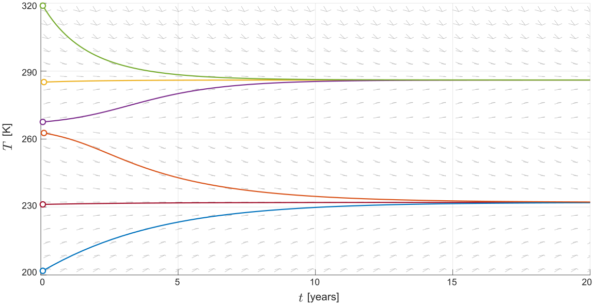

# [Qualitative Analysis of ODEs](https://github.com/MathWorks-Teaching-Resources/Qualitative-Analysis-of-ODEs#qualitative-analysis-of-odes-)

 or 

**Curriculum Module**

_Created with R2021a. Compatible with R2021a and later releases._

# Information

This curriculum module contains interactive [MATLAB® live scripts](https://www.mathworks.com/products/matlab/live-editor.html) that teaches qualitative analysis of ordinary differential equations (ODEs).

## Background

You can use these live scripts as demonstrations in lectures, class activities, or interactive assignments outside class. The first two scripts consider first order ODEs. In these scripts, students draw solutions on a slope field, identify and classify equilibria, and draw phase line portraits. In the second half of the module, students analyze systems of two autonomous ODEs. In this part, students create phase plane portraits, solve for equilibria, and classify equilibria of linear systems by examining the eigenvalues of the coefficient matrix. Throughout the module, students apply the mathematical tools to study an energy balance climate model and a mass-spring-damper model.

The instructions inside the live scripts will guide you through the exercises and activities. Get started with each live script by running it one section at a time. To stop running the script or a section midway (for example, when an animation is in progress), use the  Stop button in the **RUN** section of the **Live Editor** tab in the MATLAB Toolstrip.

## Contact Us

Solutions are available upon instructor request. Contact the [MathWorks teaching resources team](mailto:onlineteaching@mathworks.com) if you would like to request solutions, provide feedback, or if you have a question.

## Prerequisites

This module assumes knowledge of differential calculus concepts and notation: both $y^{\prime }$ and $\frac{dy}{dt}$ are used. There is minimal MATLAB knowledge required for these scripts, but you could use [<u>MATLAB Onramp</u>](https://matlabacademy.mathworks.com/details/matlab-onramp/gettingstarted) as a resource to acquire familiarity with live scripts and MATLAB syntax.

## Getting Started
### Accessing the Module
### **On MATLAB Online:**

Use the  link to download the module. You will be prompted to log in or create a MathWorks account. The project will be loaded, and you will see an app with several navigation options to get you started.

### **On Desktop:**

Download or clone this repository. Open MATLAB, navigate to the folder containing these scripts and double-click on [ODE_Analysis.prj](https://matlab.mathworks.com/open/github/v1?repo=MathWorks-Teaching-Resources/Qualitative-Analysis-of-ODEs&project=ODE_Analysis.prj). It will add the appropriate files to your MATLAB path and open an app that asks you where you would like to start. 

Ensure you have all the required products ([listed below](#H_E850B4FF)) installed. If you need to include a product, add it using the Add-On Explorer. To install an add-on, go to the **Home** tab and select   **Add-Ons** > **Get Add-Ons**. 

## Products

MATLAB® and Symbolic Math Toolbox™ are used throughout.

# Scripts
## [**SlopeFields.mlx**](https://matlab.mathworks.com/open/github/v1?repo=MathWorks-Teaching-Resources/Qualitative-Analysis-of-ODEs&project=ODE_Analysis.prj&file=SlopeFields.mlx) 
|  | **In this script, students will...** | **Applications**  |
| :-- | :-- | :-- |
|  | -  classify ODEs as autonomous or non-autonomous  -  describe how a slope field is generated  -  draw ODE solutions through the slope field by hand  -  explain the physical meaning of terms in an energy balance climate model  -  plot solutions of the energy balance climate model | Energy balance model  |

## [**Equilibria1D.mlx**](https://matlab.mathworks.com/open/github/v1?repo=MathWorks-Teaching-Resources/Qualitative-Analysis-of-ODEs&project=ODE_Analysis.prj&file=Equilibria1D.mlx) 
|  | **In this script, students will...** | Application  |
| :-- | :-- | :-- |
|  | -  solve for equilibria of autonomous first order ODEs  -  classify equilibria as stable, unstable, or semi-stable  -  draw phase line portraits of autonomous ODEs and relate them to the slope field  -  find the equilibria of the energy balance climate model  -  describe the real-world meaning of the climate model equilibria | Energy balance model  |

## [**PhasePlanes.mlx**](https://matlab.mathworks.com/open/github/v1?repo=MathWorks-Teaching-Resources/Qualitative-Analysis-of-ODEs&project=ODE_Analysis.prj&file=PhasePlanes.mlx) 
|  | **In this script, students will...** | Application  |
| :-- | :-- | :-- |
|  | -  write a second order ODE as a first order ODE system  -  describe how a phase plane is generated  -  relate solutions plotted on the phase plane to time series solution plots  -  compare behaviors of the mass-spring-damper model under variations in the damping coefficient |   |

## [**LinearPhasePlaneAnalysis.mlx**](https://matlab.mathworks.com/open/github/v1?repo=MathWorks-Teaching-Resources/Qualitative-Analysis-of-ODEs&project=ODE_Analysis.prj&file=LinearPhasePlaneAnalysis.mlx) 
|  | **In this script, students will...** | Application  |
| :-- | :-- | :-- |
|  | -  find equilibria of a second order ODE system  -  compute the eigenvalues of the coefficient matrix of a linear ODE system  -  classify equilibria as nodes, saddles, spirals, or centers  -  categorize the behavior of the mass-spring-damper model by analyzing its coefficient matrix |   |

# Related Courseware Modules

## [Phase Plane and Slope Field](https://www.mathworks.com/matlabcentral/fileexchange/91705-phase-plane-and-slope-field-apps) 
|  | **Available on:** *(edit hyperlink accordingly)* *(edit hyperlink accordingly)*[GitHub](https://github.com/MathWorks-Teaching-Resources/Phase-Plane-and-Slope-Field) *(edit hyperlink accordingly)*  |
| :-- | :-- |

Or feel free to explore our other [modular courseware content](https://www.mathworks.com/matlabcentral/fileexchange/?q=tag%3A%22courseware+module%22&sort=downloads_desc_30d).

# Related Self-Paced Online Courses

[Solving Ordinary Differential Equations with MATLAB](https://matlabacademy.mathworks.com/details/solving-ordinary-differential-equations-with-matlab/odes) 

Learn the basics of solving ordinary differential equations in MATLAB. Use MATLAB ODE solvers to find solutions to ordinary differential equations that describe phenomena ranging from population dynamics to the evolution of the universe.

# Educator Resources
-  [Educator Page](https://www.mathworks.com/academia/educators.html) 

# Contribute 

Looking for more? Find an issue? Have a suggestion? Please contact the [MathWorks teaching resources team](mailto:%20onlineteaching@mathworks.com). If you want to contribute directly to this project, you can find information about how to do so in the [CONTRIBUTING.md](https://github.com/MathWorks-Teaching-Resources/Qualitative-Analysis-of-ODEs/blob/release/CONTRIBUTING.md) page on GitHub.

 *©* Copyright 2023 The MathWorks™, Inc

